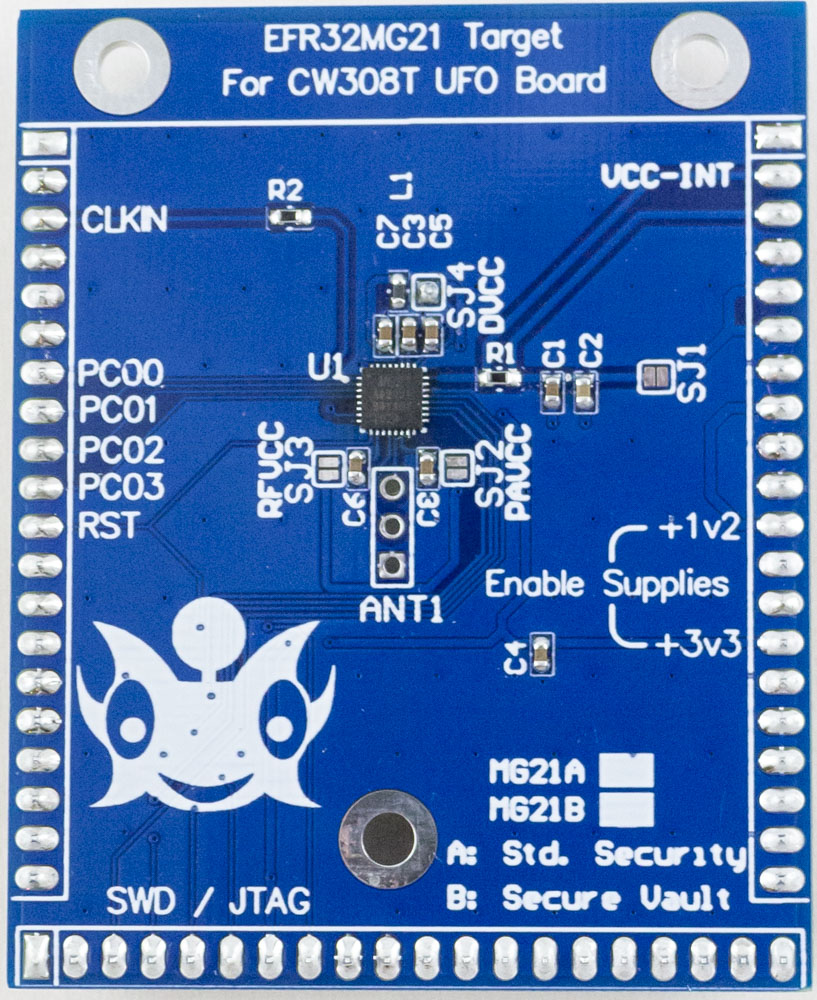

# CW308T-EFR32MG21

The EFR32MG21A board features the EFR32MG21A010F1024 from Silicon Labs. This device features a number of security features, including a dedicated “Secure Element” core that performs a secure boot operation, and DPA countermeasures on cryptographic primitives.

The RF section is not broken out to a 50-ohm matched header, but instead a simple 3-pin header which allows potential usage in laboratory environments.

See the -SOCKET board for an optional socket version.
See the -MG21B board for the version wtih ‘Secure Vault’.

!!! attention
    This target requires an external programmer for the MPC5748G to reload code.

---

## Quick Links

* [Buy on Mouser](https://www.mouser.com/Search/Refine?Keyword=NAE-CW308T-EFR32MG21A)
* [Download Schematic](https://github.com/newaetech/chipwhisperer-target-cw308t/raw/master/CW308T_EFR32MG21/NAE-CW308T-EFR32MG21-02_Schematic.PDF)

## Specifications

| Feature | Notes/Range |
|---------|----------|
| Target Device | EFR32MG21A010F1024 |
| Target Architecture | Arm Cortex M33 |
| Vcc | 1.2V |
| Programming | JTAG |
| Hardware Crypto | Yes |
| Availability | Standalone |
| Status | Production |
| Shunt | 22-ohm |

## Power Supply

Break-out for various voltage rails, allowing over-driving of internal regulator to reduce noise for DPA measurements, or for testing fault injection detection capability.

---

## Security Features

EFR32MG21A (“Mighty Gecko Multiprotocol Wireless SoC”) has a high-performance Cortex M33 (TrustZone-M) with  a seperate “secure element” core that handles the secure boot operation, along with multiple cryptographic accelerators (both AES and ECC) that include advertised DPA countermeasures.

---

## Programming

A JTAG programmer is typically required for these devices.

---

## Schematic and Layout
